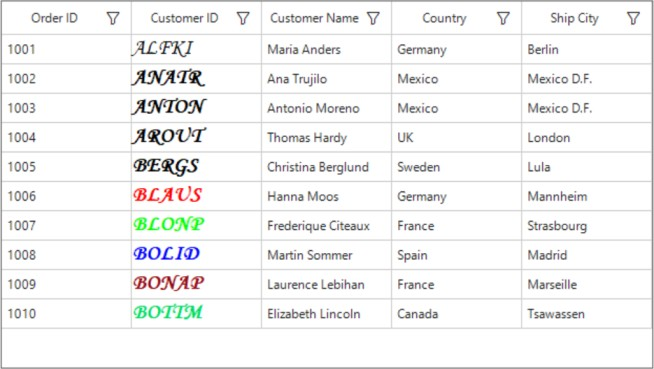

# How to display rich text in WinForms DataGrid?
This example explains how to display rich text in WinForms DataGrid.

[WinForms DataGrid](https://www.syncfusion.com/winforms-ui-controls/datagrid) (SfDataGrid) doesn't have direct support to display RichText’s in the [GridTextColumn](https://help.syncfusion.com/cr/windowsforms/Syncfusion.WinForms.DataGrid.GridTextColumn.html). However, it is possible to achieve this by overriding the [OnRender](https://help.syncfusion.com/cr/windowsforms/Syncfusion.WinForms.DataGrid.Renderers.GridTextBoxCellRenderer.html#Syncfusion_WinForms_DataGrid_Renderers_GridTextBoxCellRenderer_OnRender_System_Drawing_Graphics_System_Drawing_Rectangle_System_String_Syncfusion_WinForms_DataGrid_Styles_CellStyleInfo_Syncfusion_WinForms_DataGrid_DataColumnBase_Syncfusion_WinForms_GridCommon_ScrollAxis_RowColumnIndex_) method in [GridTextBoxCellRenderer](https://help.syncfusion.com/cr/windowsforms/Syncfusion.WinForms.DataGrid.Renderers.GridTextBoxCellRenderer.html).

### C#

```c#
//customize the TextBoxCellRenderer
this.sfDataGrid1.CellRenderers.Remove("TextBox");
this.sfDataGrid1.CellRenderers.Add("TextBox", new GridRichTextCellRenderer());

public class GridRichTextCellRenderer : GridTextBoxCellRenderer
{
    protected override void OnRender(Graphics paint, Rectangle cellRect, string cellValue, CellStyleInfo style, DataColumnBase column, RowColumnIndex rowColumnIndex)
    {
        //here customize based on your scenario
        if (column.GridColumn.MappingName == "CustomerID")
        {   //here draw the richtex in SfDataGrid             
            TextPainter.DrawRichText(paint, cellValue, cellRect);                
        }
        else
            base.OnRender(paint, cellRect, cellValue, style, column, rowColumnIndex);
    }
}   

```

### VB

```VB
'customize the TextBoxCellRenderer 
Me.sfDataGrid1.CellRenderers.Remove("TextBox")
Me.sfDataGrid1.CellRenderers.Add("TextBox", New GridRichTextCellRenderer())

Public Class GridRichTextCellRenderer
	Inherits GridTextBoxCellRenderer

	Protected Overrides Sub OnRender(ByVal paint As Graphics, ByVal cellRect As Rectangle, ByVal cellValue As String, ByVal style As CellStyleInfo, ByVal column As DataColumnBase, ByVal rowColumnIndex As RowColumnIndex)
		'here customize based on your scenario
		If column.GridColumn.MappingName = "CustomerID" Then 'here draw the richtex in SfDataGrid
			TextPainter.DrawRichText(paint, cellValue, cellRect)
		Else
			MyBase.OnRender(paint, cellRect, cellValue, style, column, row-ColumnIndex)
		End If
	End Sub
End Class

```



## Requirements to run the demo
Visual Studio 2015 and above versions
